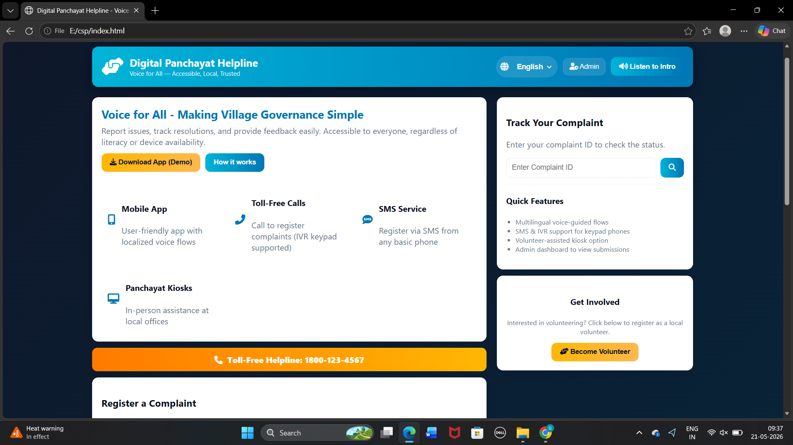

# 🌐 Digital Panchayat Helpline

> **Voice for All — Accessible, Local, Trusted**

A modern and user-friendly web platform designed to simplify village governance by enabling citizens to register complaints, track resolutions, and communicate with local authorities easily.

---

## 🚀 Features

✨ **Complaint Registration System**  
Residents can submit complaints related to:
- 🛣 Roads
- 💡 Electricity
- 🚰 Water Supply
- 🪪 Ration Cards
- 👵 Pension Issues
- 📌 Other Village Problems

🎙 **Voice Assistance**
- Speech-to-text complaint input
- Text-to-speech guidance
- Multi-language accessibility

🌍 **Multi-Language Support**
- English
- తెలుగు
- हिंदी
- தமிழ்
- বাংলা

📱 **Multiple Access Methods**
- Mobile App Support
- Toll-Free Calling
- SMS Complaint Registration
- Panchayat Kiosk Assistance

📊 **Complaint Tracking**
Users can:
- Track complaint status
- View progress stages
- Receive updates

👥 **Volunteer Support**
- Local volunteer registration
- Field assistance system

🛠 **Admin Dashboard**
- View submissions
- Mark complaints resolved
- Export complaint data

---

## 🖥️ Tech Stack

| Technology | Usage |
|------------|-------|
| HTML5 | Structure |
| CSS3 | Styling & Responsive Design |
| JavaScript | Functionality |
| LocalStorage | Data Storage |

---

## 📸 Project Preview

## 📸 Project Preview


---

## 🎯 Objectives

- Improve rural governance accessibility
- Support digitally less-literate users
- Enable transparent complaint resolution
- Promote inclusive civic participation

---

## 📂 Project Structure

```bash
Digital-Panchayat-Helpline/
│── index.html
│── README.md
